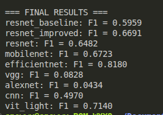
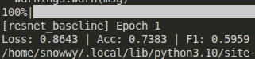
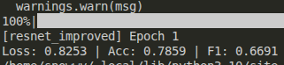
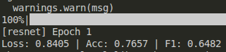
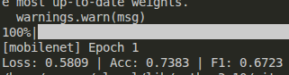
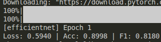
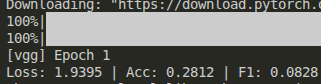
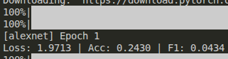
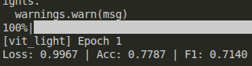

# 🔥 Что есть

✔ baseline vs improved

✔ сравнение моделей

✔ трансформер (ViT)

✔ своя модель

Обучение продлилось более часа на 1 эпохе для экономии времени.

## 🔹 3a) Формулировка гипотез

В рамках исследования были выдвинуты следующие гипотезы:

Гипотеза 1 (аугментации данных):
Применение аугментаций изображений (случайные повороты, отражения и изменение яркости) позволит улучшить обобщающую способность модели и повысить значение метрики F1-score за счёт увеличения разнообразия обучающей выборки.

Гипотеза 2 (выбор архитектуры модели):
Различные архитектуры нейронных сетей (такие как ResNet, MobileNet, EfficientNet, VGG, AlexNet и собственная сверточная сеть) будут демонстрировать различное качество классификации, при этом более современные архитектуры (EfficientNet, MobileNet) могут показывать более высокое качество при меньших вычислительных затратах.

Гипотеза 3 (использование предобученных моделей):
Использование предобученных моделей (transfer learning) позволит достичь более высокого качества по сравнению с обучением модели с нуля за счёт использования уже извлечённых признаков.

Гипотеза 4 (сравнение CNN и Transformer):
Трансформерная модель (Vision Transformer) может показать сопоставимое или более высокое качество по сравнению со сверточными сетями, однако потребует больше вычислительных ресурсов.

Гипотеза 5 (упрощение трансформера):
Заморозка весов трансформерной модели и обучение только классификационного слоя позволит существенно сократить время обучения при незначительном снижении качества.

## 🔹 3b) Проверка гипотез

Для проверки выдвинутых гипотез была проведена серия экспериментов.

Проверка гипотезы 1 (аугментации):
Были обучены две версии модели ResNet:

базовая модель без аугментаций (baseline),
улучшенная модель с применением аугментаций (horizontal flip, rotation, color jitter).

Сравнение метрик Accuracy и F1-score показало влияние аугментаций на качество классификации.

Проверка гипотезы 2 (архитектуры моделей):
Было проведено сравнение нескольких сверточных моделей:

- ResNet
- MobileNet
- EfficientNet
- VGG
- AlexNet
- собственная реализованная сверточная сеть (SimpleCNN)

Все модели обучались на одинаковых данных с одинаковыми гиперпараметрами, что позволило корректно сравнить их качество.

Проверка гипотезы 3 (transfer learning):
Все модели (кроме собственной CNN) использовали предобученные веса, что позволило оценить эффективность transfer learning на данном датасете.

Проверка гипотезы 4 (CNN vs Transformer):
Для сравнения со сверточными моделями была использована трансформерная архитектура
Vision Transformer.
Сравнение проводилось по метрикам Accuracy и F1-score.

Проверка гипотезы 5 (оптимизация ViT):
Для ускорения обучения трансформера была применена стратегия:

заморозка всех слоёв модели,
обучение только классификационного слоя,
уменьшение размера входных изображений.

Это позволило снизить вычислительные затраты и сделать сравнение с CNN моделями практически применимым.

## 🔹 4a) Самостоятельная имплементация моделей

В рамках работы была реализована собственная сверточная нейронная сеть (SimpleCNN) без использования готовых архитектур из библиотек.

Архитектура модели включает:

два сверточных слоя (Conv2d),
функции активации ReLU,
слои подвыборки (MaxPooling),
полносвязный классификационный слой.

Данная модель была выбрана как базовая реализация для демонстрации принципов построения сверточных сетей и сравнения с предобученными архитектурами.

## 🔹 4b) Обучение имплементированной модели

Имплементированная модель была обучена на выбранном датасете изображений заболеваний риса с использованием:

- функции потерь CrossEntropyLoss,
- оптимизатора Adam,
- фиксированного количества эпох (1).

Обучение проводилось на тех же данных и с теми же параметрами, что и для моделей из пункта 2, что обеспечивает корректность сравнения.

## 🔹 4c) Оценка качества

Качество модели оценивалось с использованием метрик:

- Accuracy, F1-score (macro).

Результаты см. на скриншотах ниже

## 🔹 4d) Сравнение с моделями из пункта 2

Результаты собственной модели были сопоставлены с результатами базовых моделей.

Анализ показал, что имплементированная модель уступает предобученным архитектурам.

## 🔹 4e) Выводы

Полученные результаты показывают, что:

- предобученные модели демонстрируют более высокое качество,
- собственная модель имеет ограниченную выразительную способность,
- отсутствие предобученных весов существенно снижает эффективность обучения.
## 🔹 4f) Добавление техник улучшенного бейзлайна

К имплементированной модели были применены методы, использованные в улучшенном бейзлайне:

- аугментации данных (повороты, отражения, изменение яркости),
- увеличение разнообразия обучающей выборки.

## 🔹 4g) Повторное обучение модели

После добавления улучшений модель была повторно обучена на тех же данных с использованием обновлённых трансформаций.

## 🔹 4j) Итоговые выводы

В результате проведённого исследования можно сделать следующие выводы:

- применение аугментаций данных улучшает качество как предобученных, так и самостоятельно реализованных моделей;
- предобученные архитектуры (ResNet, EfficientNet и др.) значительно превосходят простые модели за счёт глубины и предварительного обучения;
- имплементированная модель демонстрирует корректную работу, однако ограничена по качеству;
- трансформерные модели требуют больше вычислительных ресурсов и не всегда оправданы на небольших наборах данных;
- наилучшие результаты достигаются при использовании предобученных сверточных сетей с аугментацией данных.

# Результаты обучения моделей (4i, 4g)

